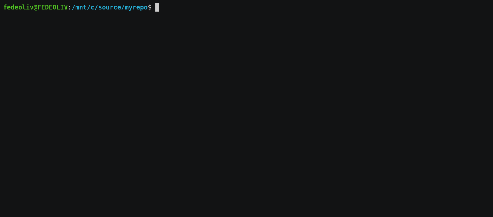

# Inclusive Linter 

As developers, we’re continually writing code, and we do that by passing messages. Each message carries a lot of context and semantics so we're always evolving how to do it in a better way. Terminology is in the roots of communication, and therefore is as vital for writing quality code as writing user stories, documentation, and even naming branches. If you care a lot about communicating effectively, I think we must use an **inclusive language** to do so.

The `inclusivelint` is a static analysis tool that enables a more inclusive language and diverse culture by looking for non-inclusive terminologies on your Git repository and suggesting new ones. The [Categories & Terminologies](./docs/categories-and-terminologies.md) section covers the categories and non-inclusive terminologies currently supported by the linter.



## Prerequisites

- [Windows Subsystem for Linux (WSL)](https://docs.microsoft.com/en-us/windows/wsl/install-win10) or Debian-based distributions (e.g. Ubuntu)
  
## Running the linter locally

There are two main ways of installing inclusivelint, manual steps or via script.

### Running all steps manually

Check out the [Releases](https://github.com/fernandoBRS/inclusive-linter/releases), update the `/<VERSION>` below with the latest version and download it:

```sh
wget https://github.com/fernandoBRS/inclusive-linter/releases/download/<VERSION>/inclusivelint
```

Set the `inclusivelint` as an executable and move it to `/usr/bin` directory:

```sh
sudo chmod +x inclusivelint && mv inclusivelint /usr/bin
```

Create the folder to drop the dictionary of words:

```sh
mdkir ~/.inclusivelint
```

Download the dictionary on the github releases:

```sh
wget https://github.com/fernandoBRS/inclusive-linter/releases/download/<VERSION>/outputRelation.txt
```

Move the dictionary to inclusivelint folder:

```sh
mv outputRelation.txt ~/.inclusivelint
```

### Installing via script

We created a script to make the intallation process easier. The script```install.sh``` is on the repo. To run it, do:

``` sh
sudo ./install.sh
```

### Running after installation

Then run the linter on your git repository:

```sh
inclusivelint <GIT_DIRECTORY_PATH>
```

To check the installed version, run the following command:

```sh
inclusivelint -v
```

## Development Requirements

The linter leverages a terms parser written in Python 3. If there is a need to update the dictionary located on ```parsers/outputRelation.txt```, make sure you have Python 3.x installed then run it:

```sh
python retextEqualityParser.py
```

Note: be sure that ```python``` command is pointing to python3.*. To check it do:

``` sh
python --version
```

The parser receives the ```wordsTable.md``` as input and create/update the dictionary on the
```outputRelation.txt```, located on the same directory.

## Running the linter in CI pipelines

### **GitHub Actions**

```yaml
jobs:
  build:
    runs-on: ubuntu-latest

    steps:
    - uses: actions/checkout@v2

    - name: Install inclusive linter
      run: |
        wget https://github.com/fernandoBRS/inclusive-linter/releases/download/<VERSION>/inclusivelint
        sudo chmod +x inclusivelint && mv inclusivelint /usr/bin
        mdkir ~/.inclusivelint
        wget https://github.com/fernandoBRS/inclusive-linter/releases/download/<VERSION>/outputRelation.txt
        mv outputRelation.txt ~/.inclusivelint
    - name: Run inclusive linter
      run: |
        export TERM=xterm
        inclusivelint .
```

> Hint: You can set the linter version as an [environment variable](https://docs.github.com/en/actions/configuring-and-managing-workflows/using-environment-variables) on your pipeline to not let it hardcoded.

### **Azure DevOps**

```yaml
steps:
- script: |
    wget https://github.com/fernandoBRS/inclusive-linter/releases/download/<VERSION>/inclusivelint
    sudo chmod +x inclusivelint && mv inclusivelint /usr/bin
    mdkir ~/.inclusivelint
    wget https://github.com/fernandoBRS/inclusive-linter/releases/download/<VERSION>/outputRelation.txt
    mv outputRelation.txt ~/.inclusivelint
  displayName: Install inclusive linter
- script: |
    export TERM=xterm
    inclusivelint .
  displayName: Run inclusive linter
````

> Hint: You can use a [variable group](https://docs.microsoft.com/en-us/azure/devops/pipelines/library/variable-groups?view=azure-devops&tabs=yaml) on your pipeline to set the linter version as an environment variable to not let it hardcoded.

## Additional documentation

- [How the search engine works](./docs/search-engine.md)
